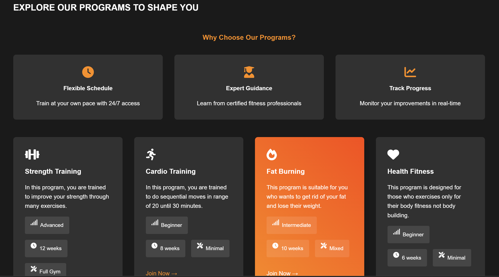

# NeatFit - Fitness Training Website

A responsive fitness website built with HTML, CSS, and JavaScript that offers personalized workout programs and exercise recommendations.

## 🚀 Key Features
### 1. Dynamic Dashboard
- Real-time fitness metrics tracking
- Interactive progress charts using Chart.js
- Animated statistics and achievements display

### 2. Comprehensive Workout Programs
- Strength Training Program
- Cardio Training Program
- Fat Burning Program
- Health Fitness Program

### 3. Exercise Library
- Detailed video demonstrations
- Equipment and no-equipment alternatives
- Step-by-step instructions
- Proper form guidance

### 4. Progress Tracking
- Weekly activity visualization
- Goal completion metrics
- Monthly progress trends
- Visual progress indicators

### 5. User Interface
- Responsive design for all devices
- Smooth animations and transitions
- Intuitive navigation
- Modern and clean aesthetic


## Features
- Interactive landing page with dynamic statistics
- Multiple fitness program categories
- Detailed exercise demonstrations with equipment and no-equipment alternatives
- Real-time heart rate and calorie tracking visualization
- Progress tracking with interactive charts
- Animated UI elements for enhanced user experience

## 🛠️ Technology Stack
- HTML5 for structure
- CSS3 for styling and animations
- Vanilla JavaScript for interactivity
- Chart.js for data visualization
- Font Awesome for icons

## 🏃‍♂️ Quick Start
1. Clone the repository
2. Open `index.html` in your browser
3. Start exploring workout programs

## 📈 Project Structure
```
neatfit/
├── index.html           # Main HTML file containing the website structure
├── styles.css          # CSS styles for the entire application
└── scripts.js         # JavaScript functionality and exercise data
```

## 🎯 Future Features
- Progress tracking system
- Custom workout builder
- Exercise video demonstrations

---

